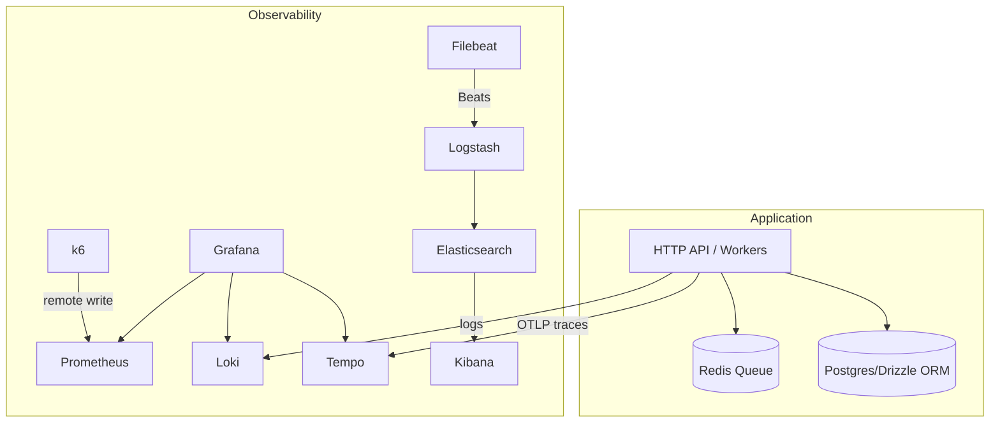

# System Design Playground

A learning playground for designing and building production-like systems with clear business domains and pragmatic architecture patterns. Includes ready-to-run observability stacks (LGTM and ELK) to practice metrics, logs, and traces locally.



## What is this?

- Business-driven services to practice design and implementation
- Opinionated architecture principles (DDD, Hexagonal, DI, explicit side effects)
- Two observability stacks you can switch between: LGTM and ELK
- Load testing via k6 with Prometheus remote write

## Quick start

Requirements: Node.js, Docker, and Docker Compose installed.

Install deps and build:

```bash
yarn
yarn build
```

Start the app during development:

```bash
yarn dev
```

## Observability

See [docs/obs-stack.md](docs/obs-stack.md) for diagrams and details. Short commands:

### LGTM (Loki, Grafana, Tempo, Prometheus)

```bash
npm run obs:lgtm:start
npm run obs:lgtm:stop
npm run obs:lgtm:down
npm run obs:lgtm:destroy
```
- Grafana: http://localhost:3300
- Prometheus remote write (for k6): http://localhost:9091/api/v1/write
- Loki: http://localhost:33100
- Tempo: http://localhost:33200 (OTLP gRPC 24317, OTLP HTTP 24318)

### ELK (Elasticsearch, Logstash, Kibana) + Filebeat

```bash
npm run obs:elk:start
npm run obs:elk:stop
npm run obs:elk:down
npm run obs:elk:destroy
```
- Kibana: http://localhost:5601
- Elasticsearch: http://localhost:9200

#### Application logs → ELK pipeline (local dev)

- App logging: `pino` writes newline-delimited JSON to `logs/app.json` and stdout
- Mount: Filebeat service mounts repo `logs/` to container path `/host-logs`
- Filebeat: reads `/host-logs/app.json` as NDJSON and ships to Logstash
- Logstash: normalizes to ECS (`message`, `log.level`, `process.pid`, `host.hostname`)
- Labels added for easy filtering: `project=system-design-playground`, `source=application|stack`, `service.name=system-design-playground-app`

Key files:
- [observability/stacks/elk/docker-compose.elk.yml](observability/stacks/elk/docker-compose.elk.yml)
- [observability/stacks/elk/filebeat/filebeat.yml](observability/stacks/elk/filebeat/filebeat.yml)
- [observability/stacks/elk/logstash/pipeline/logstash.conf](observability/stacks/elk/logstash/pipeline/logstash.conf)
- [src/lib/logger.ts](src/lib/logger.ts)

Kibana setup:
- Stack Management → Data views → New
  - Index pattern: `logs-*`
  - Timestamp field: `@timestamp`
- Discover filters:
  - Application logs: `project:"system-design-playground" AND source:"application"`
  - Stack logs: `project:"system-design-playground" AND source:"stack"`

## Project layout

- `src/` — services, domains, workers, and infrastructure
- `observability/` — docker-compose stacks and configs for LGTM and ELK
- `tests/load/` — k6 load tests
- `docs/` — product, system, observability documentation

Docs quick links:
- [docs/product.md](docs/product.md) — product scope and services
- [docs/system.md](docs/system.md) — design principles
- [docs/obs-stack.md](docs/obs-stack.md) — observability stacks, ports, commands
- [docs/implementation_status.md](docs/implementation_status.md) — current TODOs/next steps

## Architecture principles

Summarized from [docs/system.md](docs/system.md):
- Ubiquitous language aligned with business terms
- Domain-Driven Design for modular boundaries
- Hexagonal Architecture with clear ports/adapters
- Dependency Injection; wire concrete adapters at composition root
- Explicit side effects placed at the end of service flows

## Product context

From [docs/product.md](docs/product.md) (draft): onboarding/KYC, credit approval, loan application, cash inventory management, and risk mitigation are modeled as separate domains for practice.

## Current implementation status

- Queue abstraction and Redis adapter:
  - [src/infra/queue/QueuePort.ts](src/infra/queue/QueuePort.ts)
  - [src/infra/queue/RedisQueueAdapter.ts](src/infra/queue/RedisQueueAdapter.ts)
- Onboarding domain wiring:
  - [src/services/onboarding/OnboardingService.ts](src/services/onboarding/OnboardingService.ts) (enqueue on submit)
  - [src/services/onboarding/OnboardingRepository.ts](src/services/onboarding/OnboardingRepository.ts) (persist/query)
  - [src/services/onboarding/processors/OnboardingApplicationProcessor.ts](src/services/onboarding/processors/OnboardingApplicationProcessor.ts) (worker logic)
  - [src/workers/onboarding/OnboardingApplicationWorker.ts](src/workers/onboarding/OnboardingApplicationWorker.ts) (entrypoint)
- See [docs/implementation_status.md](docs/implementation_status.md) for next steps.

## License

ISC
