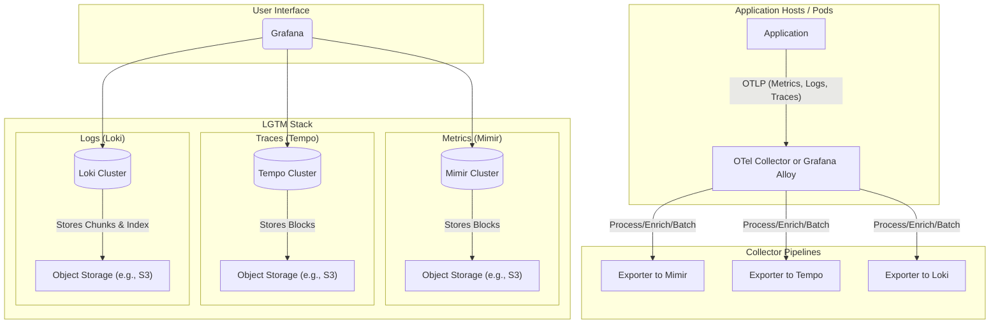
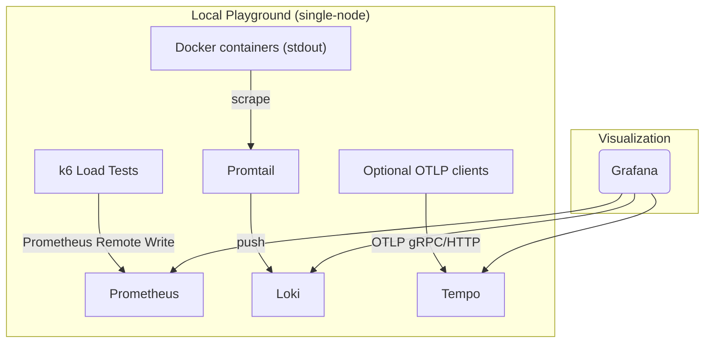
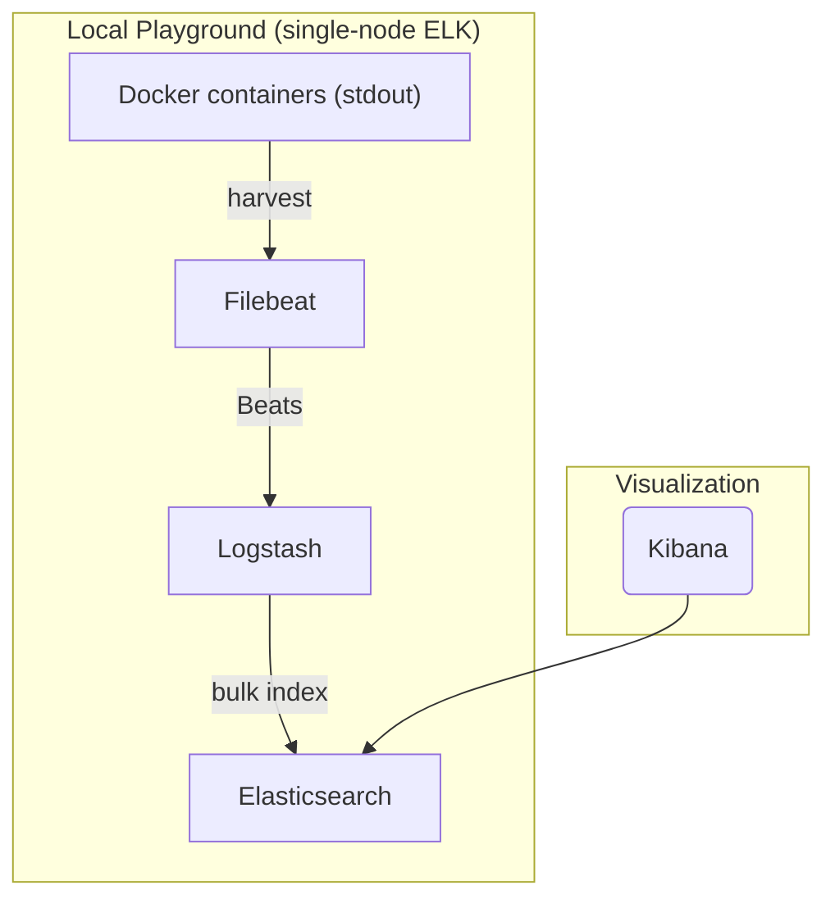

# Observability Stack

## Production reference architecture

The following diagram shows an idealized LGTM stack with a collector tier and object storage backends. Use this as a reference for production deployments.

## Local playground stacks (this repo)

This repo supports two single-node stacks for experimentation: LGTM and ELK. You can run either one independently.

### LGTM (Loki, Grafana, Tempo, Prometheus)

We use Prometheus (metrics), Loki (logs), Tempo (traces), Promtail (log shipper), and Grafana. k6 writes metrics directly to Prometheus via remote write.

### Ports (host → container)

- Prometheus: 9091 → 9090
- Grafana: 3300 → 3000
- Loki: 33100 → 3100
- Tempo: 33200 → 3200, 24317 → 4317 (OTLP gRPC), 24318 → 4318 (OTLP HTTP)

### Persistence

- Prometheus: `prometheus-data-lgtm` → `/prometheus`
- Grafana: `grafana-data-lgtm` → `/var/lib/grafana`
- Loki: `loki-data-lgtm` → `/loki`
- Promtail: `promtail-data-lgtm` → `/tmp` (positions)
- Tempo: `tempo-data-lgtm` → `/var/tempo`

### Commands

- Start: `npm run obs:lgtm:start`
- Stop (keep data): `npm run obs:lgtm:stop`
- Down (keep volumes): `npm run obs:lgtm:down`
- Destroy (wipe volumes): `npm run obs:lgtm:destroy`
- Run k6 test: `npm run test:load`

### ELK (Elasticsearch, Logstash, Kibana) + Filebeat

ELK is a popular stack with abundant online resources. Filebeat ships Docker container logs to Logstash, which forwards to Elasticsearch. Kibana provides visualization.

### Ports (host → container)

- Elasticsearch: 9200 → 9200
- Kibana: 5601 → 5601
- Logstash Beats input: 5044 → 5044

### Persistence

- Elasticsearch data: `es-data-elk` → `/usr/share/elasticsearch/data`

### Commands

- Start: `npm run obs:elk:start`
- Stop (keep data): `npm run obs:elk:stop`
- Down (keep volumes): `npm run obs:elk:down`
- Destroy (wipe volumes): `npm run obs:elk:destroy`

